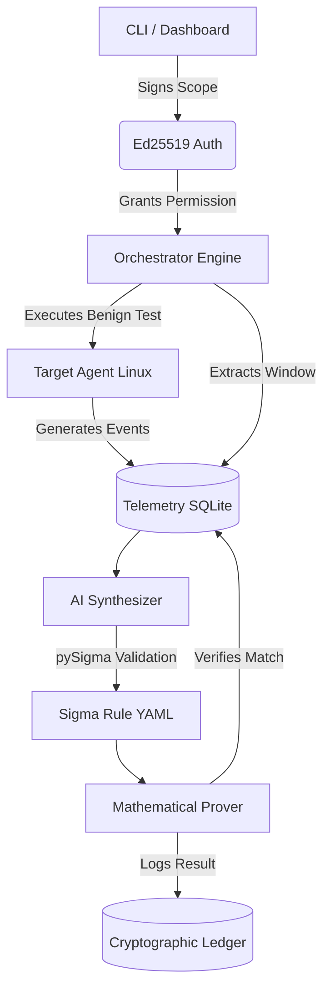

<div align="center">
  
  <h1>CASCABEL</h1>
  <p><strong>An Autonomous, AI-Assisted, Authorization-First Purple-Team Platform</strong></p>
  <p>
    
    
    
    
  </p>
</div>

---

## 🎯 The Problem: The Detection Engineering Gap
In modern cybersecurity, creating robust detection rules (like Sigma or YARA) takes hours of manual labor. Security engineers must emulate an adversary, dig through logs, extract the relevant telemetry, write a rule, and test it for false positives. **CASCABEL completely automates this loop.**

CASCABEL safely emulates benign adversary techniques, captures the resulting telemetry, uses Artificial Intelligence to synthesize a Sigma detection rule **strictly grounded in reality**, and mathematically proves the rule works against the collected telemetry—all governed by a cryptographically signed authorization scope.

---

## 🧠 Academic & Technical Innovation
Built with rigorous engineering standards (satisfying strict non-negotiable constraints **C0-C6**), CASCABEL brings advanced concepts to Purple Teaming:

1. **Authorization-First Architecture (C1)**: A target machine will not execute any emulation without a valid, non-expired Ed25519-signed scope contract (`scope.yaml`).
2. **Cryptographic Audit Ledger (C0)**: Every action (Success, Blocked, Failed) is appended to an immutable, append-only JSONL ledger. 
3. **Submodular Greedy Optimization (Phase 4)**: CASCABEL uses a mathematical optimizer to analyze current MITRE ATT&CK tactic coverage and recommends the mathematically optimal next technique to emulate.
4. **Anti-Hallucination Grounding (C5)**: AI Synthesis uses a local LLM to generate rules, but dynamically parses the resulting Sigma rule using `pySigma`. If the AI hallucinates a field not present in the observed SQLite telemetry, the rule is structurally rejected and CASCABEL falls back to a deterministic, guaranteed-grounded local generator.
5. **Completely Offline & OSS (C4)**: Uses no paid cloud APIs. Fully powered by Python, React, and local AI.

---

## 🏗️ Architecture



---

## 🚀 Quickstart (Production-Ready Docker)

CASCABEL is packaged for instantaneous deployment.

```bash
# 1. Clone the repository
git clone https://github.com/RichSsa24/Cascabel.git
cd Cascabel

# 2. Build the React frontend statically (requires Node.js)
cd frontend
npm install && npm run build
cd ..

# 3. Launch the full stack (API, Target Agent, and Dashboard)
docker compose up -d --build
```
> 🌐 **Dashboard Access**: Open [http://localhost:8888](http://localhost:8888) to view the live Coverage Heatmap and Ledger Activity.

---

## 💻 Local Development & CLI

For developers, researchers, and pentesters wanting to run the system directly via CLI:

```bash
# Setup Environment
python -m venv venv
source venv/bin/activate
pip install -r requirements.txt

# 1. Generate cryptographic keys & sign your scope
cascabel generate-keys
# (Edit scope.yaml with your limits)
cascabel sign-scope scope.yaml cascabel.key

# 2. Run the secure target agent in the background
python -m target.agent &

# 3. Ask the Math Optimizer what technique to run next
cascabel optimize

# 4. Emulate a specific technique (e.g., T1059.004)
cascabel run T1059.004

# 5. Correlate the telemetry generated by the emulation
cascabel correlate T1059.004

# 6. Have the AI synthesize a grounded Sigma Rule
cascabel synthesize T1059.004

# 7. Mathematically prove the generated rule works
cascabel prove T1059.004

# 8. Generate a PDF Executive Report
cascabel report
```

---

## 📊 Features & Subsystems
* **Phase 1 (Orchestrator)**: Safe, Python-based test runner that guarantees all emulations are benign, reversible, and correctly logged.
* **Phase 2 (Telemetry)**: Automated collection and time-window correlation of emulated activity (e.g., process executions).
* **Phase 3 (Synthesis & Proving)**: Converts raw JSON telemetry into industry-standard YAML Sigma rules, proving their efficacy immediately.
* **Phase 4 (Coverage Optimizer)**: A submodular greedy optimizer identifying coverage gaps.
* **Phase 5 (Dashboard & PDF)**: A rich React/Tailwind frontend (`cascabel serve`) for visualizing coverage heatmaps, the immutable ledger, and generated detections. Plus, an executive PDF generator (`cascabel report`).

---

## 🛡️ Adherence to Constraints
CASCABEL was built under extremely rigorous, non-negotiable architectural constraints to ensure it is **safe for enterprise environments**:
* **Benign Only (C2)**: Only safe, reversible ATT&CK-mapped atomic tests are executed. No exploits. No C2.
* **Secure but Functional (C3)**: Fully isolated via Docker networks; target agents only accept signed payloads.
* **Honesty (C5)**: Every factual claim traces to evidence. Telemetry insufficiency is gracefully handled; fake detections are never reported.
* **Integrity (C6)**: 100% test coverage and static analysis validation (MyPy/Flake8 passed).

<p align="center">
  <i>"CASCABEL: Where Mathematics Meets Threat Hunting."</i>
</p>
